# C++ Module 09 - Detailed Technical Analysis

## Project Overview

This module demonstrates advanced STL container usage and algorithmic implementations through three distinct exercises:

1. **BitcoinExchange** - File processing with `std::map`
2. **RPN Calculator** - Stack-based expression evaluation  
3. **PmergeMe** - Advanced sorting with performance comparison

---

## Exercise 00: Bitcoin Exchange

### Architecture Overview

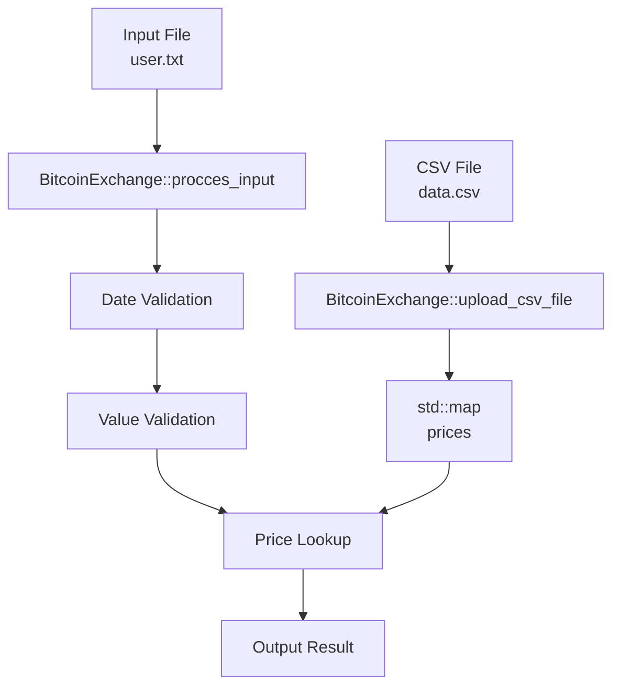

### Data Flow Diagram

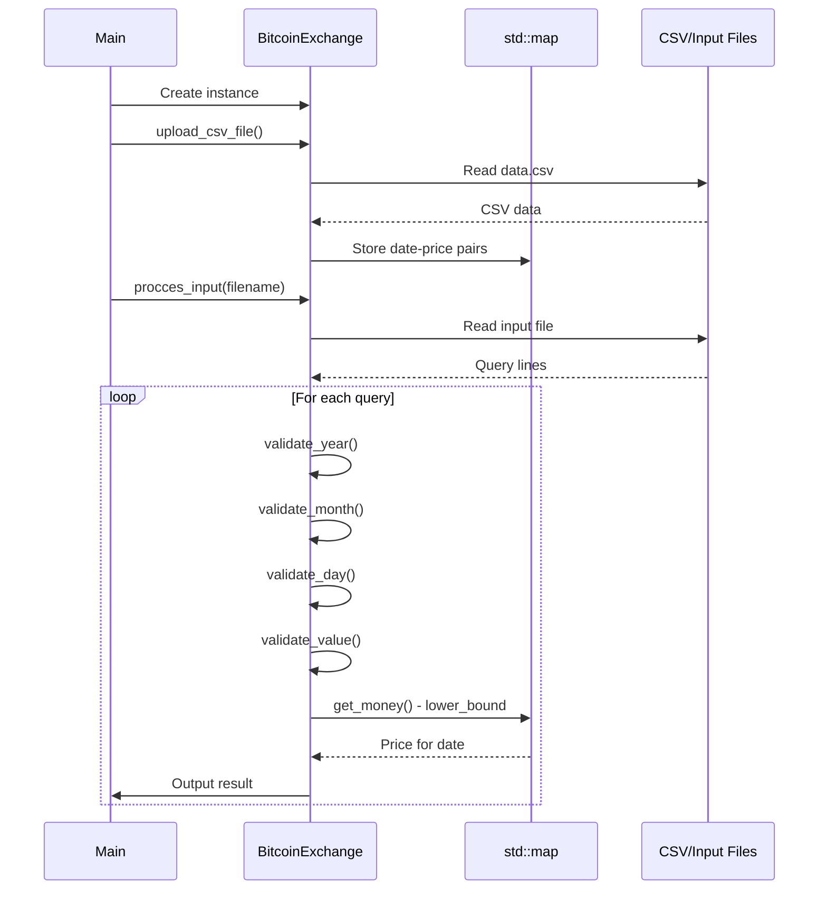

### Key Components Breakdown

#### 1. Data Storage Structure
```cpp
class BitcoinExchange {
private:
    std::map<std::string, double> prices;  // Date -> Price mapping
    
    // Date format: "YYYY-MM-DD"
    // Automatically sorted by std::map
    // O(log n) lookup time
};
```

#### 2. CSV Parsing Algorithm
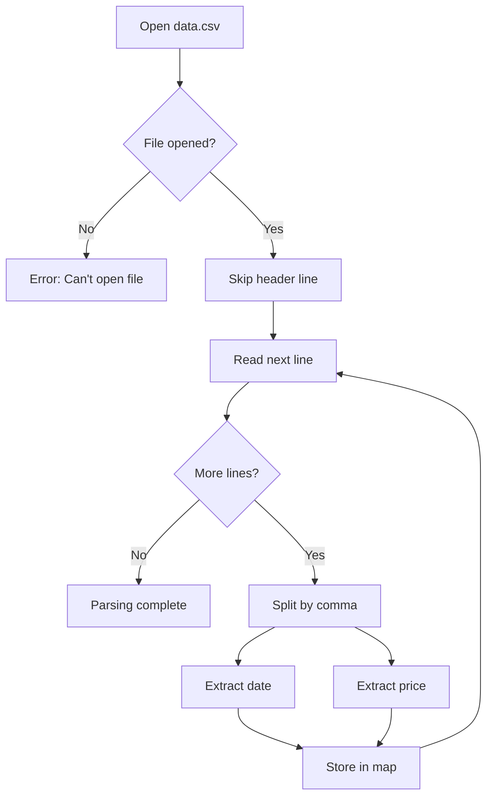

#### 3. Date Validation Logic
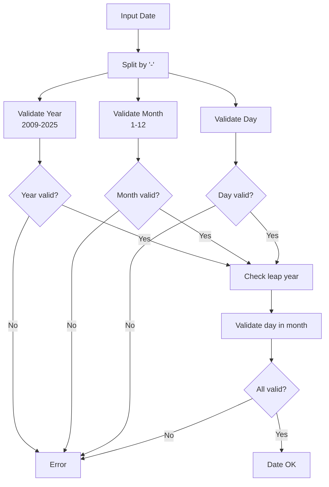

#### 4. Price Lookup Algorithm
```cpp
double get_money(std::string date_part) {
    // Use lower_bound for efficient search
    auto it = prices.lower_bound(date_part);
    
    if (it != prices.end() && it->first == date_part)
        return it->second;  // Exact match found
    
    if (it == prices.begin())
        return -1;  // Date too early
    
    --it;  // Get previous date
    return it->second;  // Return closest earlier price
}
```

### Memory Layout

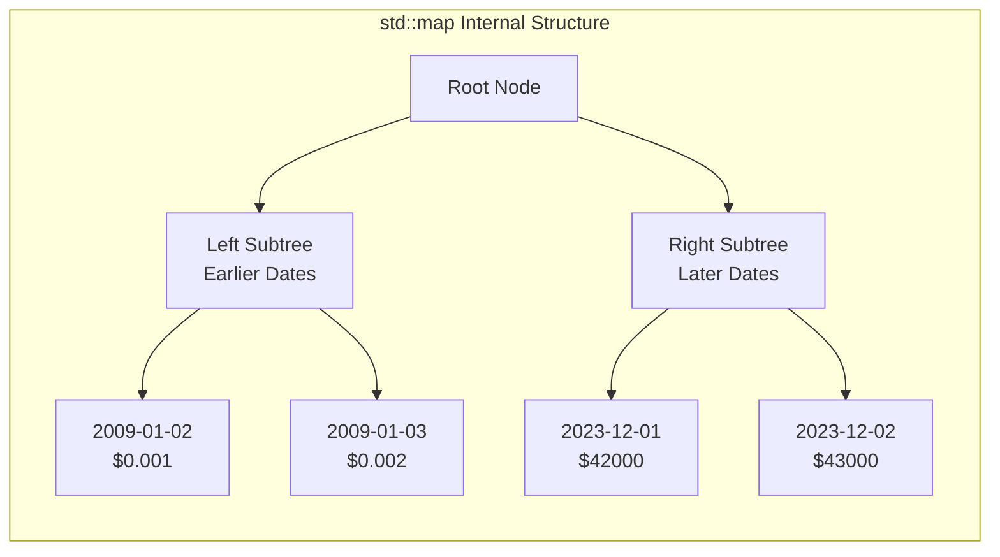

---

## Exercise 01: RPN Calculator

### Algorithm Flow

```mermaid
flowchart TD
    A[Input: "3 4 + 2 *"] --> B[Split by spaces]
    B --> C[Token Queue: 3, 4, +, 2, *]
    C --> D[Initialize empty stack]
    
    D --> E[Process next token]
    E --> F{Is number?}
    F -->|Yes| G[Push to stack]
    F -->|No| H{Is operator?}
    H -->|Yes| I[Pop 2 operands]
    H -->|No| J[Error: Invalid token]
    
    I --> K[Calculate result]
    K --> L[Push result back]
    
    G --> M{More tokens?}
    L --> M
    M -->|Yes| E
    M -->|No| N{Stack size = 1?}
    N -->|Yes| O[Return result]
    N -->|No| P[Error: Invalid expression]
```

### Stack Operations Visualization

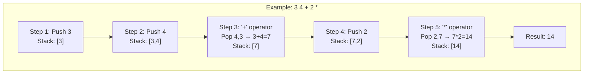

### Implementation Details

```cpp
class RPN {
    int calculate(std::string input) {
        std::stack<int> stack;
        std::stringstream ss(input);
        std::string token;
        
        while (getline(ss, token, ' ')) {
            if (isdigit(token[0])) {
                stack.push(token[0] - '0');  // Convert char to int
            } else {
                // Pop two operands (order matters!)
                int b = stack.top(); stack.pop();
                int a = stack.top(); stack.pop();
                
                int result = operate(a, b, token[0]);
                stack.push(result);
            }
        }
        
        return stack.top();
    }
};
```

---

## Exercise 02: Ford-Johnson Algorithm (PmergeMe)

### Algorithm Overview

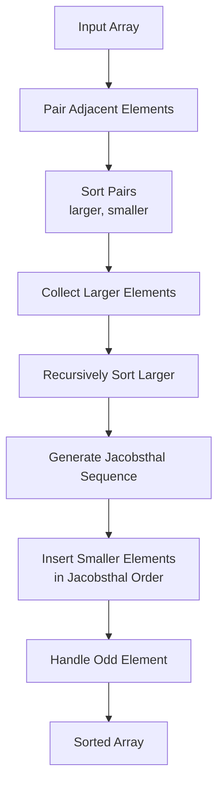

### Detailed Algorithm Steps

#### Step 1: Pairing and Comparison
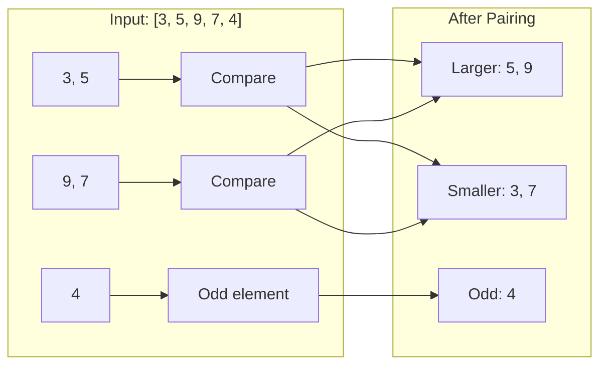

#### Step 2: Jacobsthal Number Generation
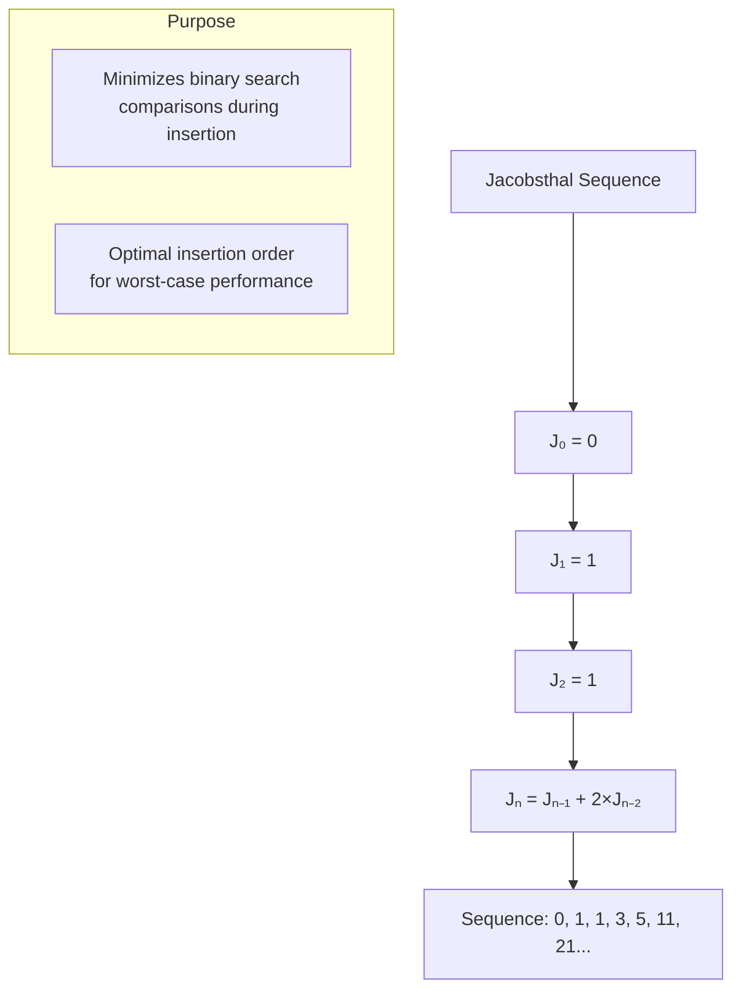

#### Step 3: Insertion Process
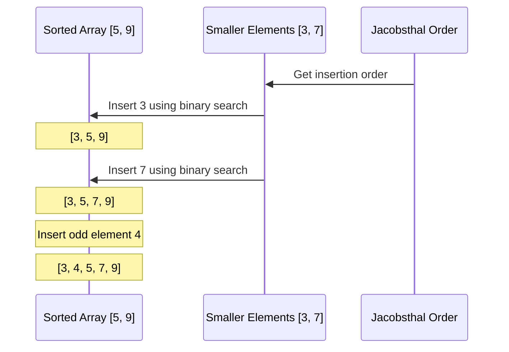

### Container Performance Comparison

```mermaid
graph TD
    subgraph "std::vector"
        A[Contiguous Memory]
        B[Cache Friendly]
        C[O(1) Random Access]
        D[O(n) Insert/Delete]
    end
    
    subgraph "std::deque"
        E[Segmented Memory]
        F[Less Cache Friendly]
        G[O(1) Random Access]
        H[O(1) Front/Back Insert]
        I[O(n) Middle Insert/Delete]
    end
    
    subgraph "Performance Measurement"
        J[clock() timer]
        K[Microseconds precision]
        L[Multiple test runs]
    end
```

### Memory Layout Comparison

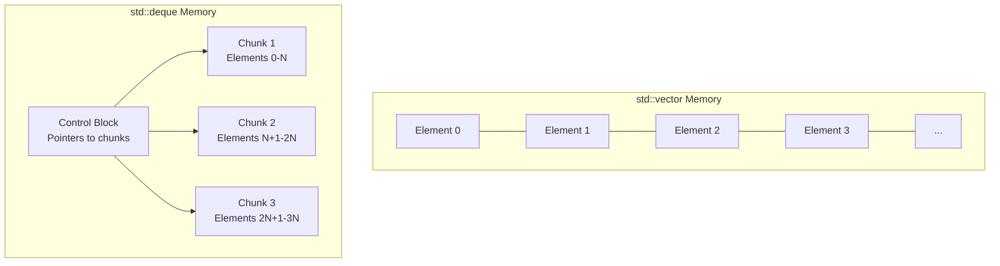

---

## Performance Analysis

### Time Complexity Summary

| Operation | BitcoinExchange | RPN Calculator | Ford-Johnson |
|-----------|-----------------|----------------|--------------|
| **Best Case** | O(log n) | O(n) | O(n log n) |
| **Average Case** | O(log n) | O(n) | O(n log n) |
| **Worst Case** | O(log n) | O(n) | O(n log n) |
| **Space** | O(n) | O(n) | O(n) |

### Container Operation Costs

```mermaid
graph LR
    subgraph "std::map"
        A[Insert: O(log n)]
        B[Search: O(log n)]
        C[Delete: O(log n)]
    end
    
    subgraph "std::stack"
        D[Push: O(1)]
        E[Pop: O(1)]
        F[Top: O(1)]
    end
    
    subgraph "std::vector"
        G[Access: O(1)]
        H[Insert end: O(1)]
        I[Insert middle: O(n)]
    end
    
    subgraph "std::deque"
        J[Access: O(1)]
        K[Insert front/back: O(1)]
        L[Insert middle: O(n)]
    end
```

---

## Real-World Applications

### BitcoinExchange Use Cases
- **Financial Trading Systems**: Real-time price lookups
- **Time-Series Databases**: Historical data queries
- **Analytics Platforms**: Market trend analysis

### RPN Calculator Use Cases
- **Scientific Calculators**: HP calculator series
- **Programming Languages**: PostScript, Forth
- **Compiler Design**: Expression parsing backends

### Ford-Johnson Sort Use Cases
- **Embedded Systems**: When comparisons are expensive
- **Database Engines**: Optimized sorting algorithms
- **Academic Research**: Algorithm complexity studies

---

## Code Quality Features

### Error Handling Strategy
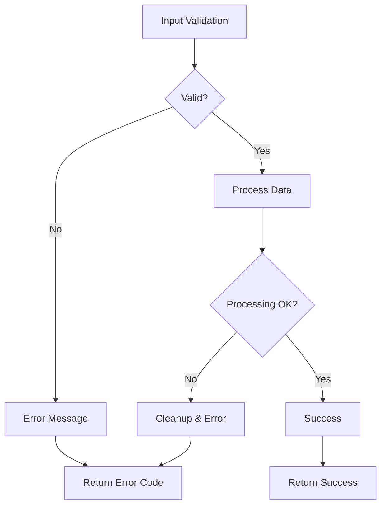

### Memory Management
- **RAII**: All containers manage their own memory
- **Exception Safety**: STL containers provide strong guarantees
- **No Raw Pointers**: Using smart containers eliminates memory leaks

### Design Patterns Used
1. **Strategy Pattern**: Different sorting algorithms for different containers
2. **Template Pattern**: Generic sorting interface
3. **Factory Pattern**: Container creation and initialization
4. **RAII Pattern**: Automatic resource management

This comprehensive analysis shows how your C++ Module 09 project demonstrates advanced programming concepts while solving real-world computational problems.