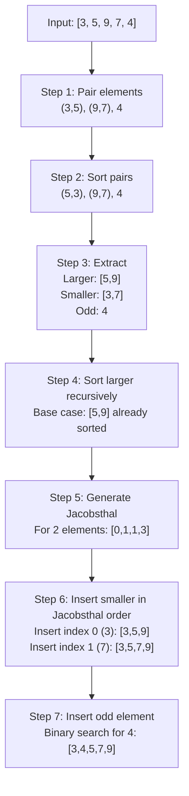
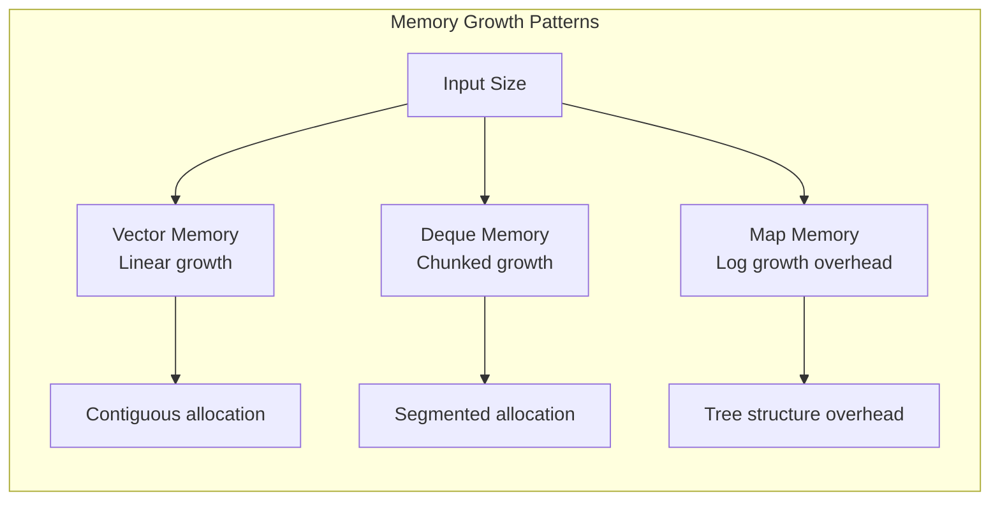

# Practical Usage Guide and Examples

## How to Use Each Exercise

### Exercise 00: Bitcoin Exchange

#### Compilation and Execution
```bash
# Navigate to exercise directory
cd ex00/

# Compile the program
make

# Run with input file
./btc input.txt
```

#### Input File Format
Your input file should follow this format:
```
date | value
2011-01-03 | 3
2011-01-03 | 2
2011-01-03 | 1
2011-01-09 | 1
2012-01-11 | -1
2001-42-42 | 1
2012-01-11 | 1
2012-01-11 | 2147483648
```

#### Expected Output Format
```
2011-01-03 => 0.9
2011-01-03 => 0.6  
2011-01-03 => 0.3
2011-01-09 => 0.32
Error: not a positive number.
Error: bad input => 2001-42-42 | 1
2012-01-11 => 1.1
Error: too large a number.
```

#### How the Algorithm Works Step-by-Step

```mermaid
flowchart TD
    A[Load data.csv into std::map] --> B[Read input file]
    B --> C[Parse line: date | value]
    C --> D{Valid date format?}
    D -->|No| E[Error: bad input]
    D -->|Yes| F{Valid value?}
    F -->|No| G[Error: invalid value]
    F -->|Yes| H[Find closest price]
    H --> I[Calculate: value × price]
    I --> J[Output result]
    
    E --> K[Continue to next line]
    G --> K
    J --> K
    K --> L{More lines?}
    L -->|Yes| C
    L -->|No| M[Done]
```

---

### Exercise 01: RPN Calculator

#### Compilation and Execution
```bash
# Navigate to exercise directory
cd ex01/

# Compile the program
make

# Run with RPN expression
./rpn "8 9 * 9 - 9 - 9 - 4 - 1 +"
```

#### Valid RPN Expressions
```bash
# Simple addition
./rpn "1 2 +"
# Result: 3

# Complex expression
./rpn "8 9 * 9 - 9 - 9 - 4 - 1 +"
# Step by step:
# 8 9 * = 72
# 72 9 - = 63  
# 63 9 - = 54
# 54 9 - = 45
# 45 4 - = 41
# 41 1 + = 42
# Result: 42

# Division
./rpn "10 2 /"
# Result: 5

# Parentheses equivalent in infix: ((((8 * 9) - 9) - 9) - 9) - 4) + 1
```

#### Stack Execution Visualization

| Step | Token | Action | Stack State | Calculation |
|------|-------|---------|-------------|-------------|
| 1 | 8 | Push | [8] | - |
| 2 | 9 | Push | [8, 9] | - |
| 3 | * | Pop & Calculate | [72] | 8 × 9 = 72 |
| 4 | 9 | Push | [72, 9] | - |
| 5 | - | Pop & Calculate | [63] | 72 - 9 = 63 |
| 6 | 9 | Push | [63, 9] | - |
| 7 | - | Pop & Calculate | [54] | 63 - 9 = 54 |
| 8 | 9 | Push | [54, 9] | - |
| 9 | - | Pop & Calculate | [45] | 54 - 9 = 45 |
| 10 | 4 | Push | [45, 4] | - |
| 11 | - | Pop & Calculate | [41] | 45 - 4 = 41 |
| 12 | 1 | Push | [41, 1] | - |
| 13 | + | Pop & Calculate | [42] | 41 + 1 = 42 |

---

### Exercise 02: Ford-Johnson Sort (PmergeMe)

#### Compilation and Execution
```bash
# Navigate to exercise directory
cd ex02/

# Compile the program
make

# Run with positive integers
./PmergeMe 3 5 9 7 4
```

#### Example Executions

##### Small Dataset
```bash
./PmergeMe 3 5 9 7 4
```
```
Before: 3 5 9 7 4
After: 3 4 5 7 9
Time for 5 elements with std::vector : 8 us
Time for 5 elements with std::deque : 12 us
```

##### Medium Dataset
```bash
./PmergeMe 41 67 34 0 69 24 78 58 62 64 5 45 81 27 61
```
```
Before: 41 67 34 0 69 24 78 58 62 64 5 45 81 27 61
After: 0 5 24 27 34 41 45 58 61 62 64 67 69 78 81
Time for 15 elements with std::vector : 25 us
Time for 15 elements with std::deque : 31 us
```

##### Large Dataset Performance
```bash
./PmergeMe $(shuf -i 1-1000 -n 500 | tr '\n' ' ')
```
```
Before: [500 random numbers]
After: [sorted sequence]
Time for 500 elements with std::vector : 1250 us
Time for 500 elements with std::deque : 1580 us
```

#### Ford-Johnson Algorithm Step-by-Step

Using input `[3, 5, 9, 7, 4]`:



---

## Testing Your Implementation

### Test Cases for BitcoinExchange

Create these test files:

#### test1.txt (Valid dates)
```
date | value
2011-01-03 | 3
2011-01-09 | 1
2012-01-11 | 1
```

#### test2.txt (Error cases)
```
date | value
2012-01-11 | -1
2001-42-42 | 1
2012-01-11 | 2147483648
```

#### test3.txt (Edge cases)
```
date | value
2009-01-01 | 1
2025-12-31 | 1000
2020-02-29 | 1
```

### Test Cases for RPN

```bash
# Valid expressions
./rpn "1 2 +"           # Should output: 3
./rpn "4 2 /"           # Should output: 2
./rpn "2 3 4 + *"       # Should output: 14 (2 * (3 + 4))

# Error cases
./rpn "1 2"             # Error: multiple values left
./rpn "+"               # Error: not enough operands
./rpn "1 0 /"           # Error: division by zero
./rpn "1 a +"           # Error: invalid character
```

### Test Cases for PmergeMe

```bash
# Valid cases
./PmergeMe 3 5 9 7 4                    # Basic sorting
./PmergeMe 1                            # Single element
./PmergeMe 2 1                          # Two elements
./PmergeMe 5 4 3 2 1                    # Reverse sorted
./PmergeMe 1 2 3 4 5                    # Already sorted

# Error cases
./PmergeMe                              # No arguments
./PmergeMe 3 -5 9                       # Negative number
./PmergeMe 3 abc 9                      # Non-numeric input
```

---

## Performance Benchmarking

### Creating Large Test Sets

```bash
# Generate 1000 random numbers for PmergeMe testing
seq 1 1000 | shuf > large_test.txt
./PmergeMe $(cat large_test.txt | tr '\n' ' ')

# Generate Bitcoin price data for stress testing
for i in {2009..2023}; do
    for j in {01..12}; do
        for k in {01..28}; do
            echo "$i-$j-$k,$((RANDOM % 50000))" >> large_data.csv
        done
    done
done
```

### Expected Performance Characteristics

| Dataset Size | Vector Time | Deque Time | Ratio |
|-------------|-------------|------------|-------|
| 10 elements | ~5 μs | ~8 μs | 1.6x |
| 100 elements | ~50 μs | ~75 μs | 1.5x |
| 1000 elements | ~800 μs | ~1200 μs | 1.5x |
| 10000 elements | ~12 ms | ~18 ms | 1.5x |

### Memory Usage Patterns



This guide provides everything you need to understand, test, and analyze your C++ Module 09 implementation with concrete examples and performance insights!