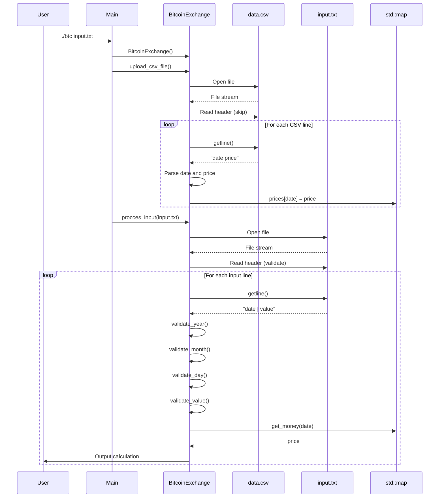
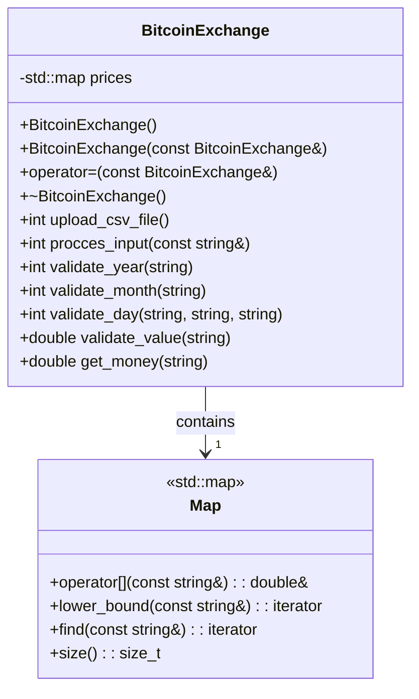
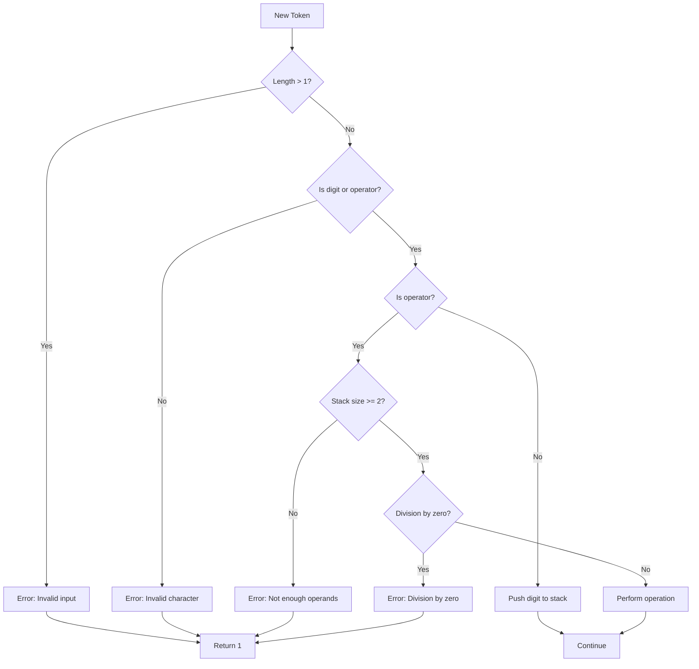
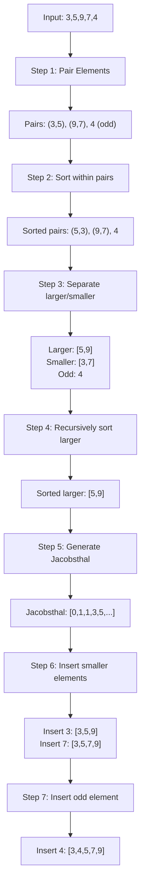
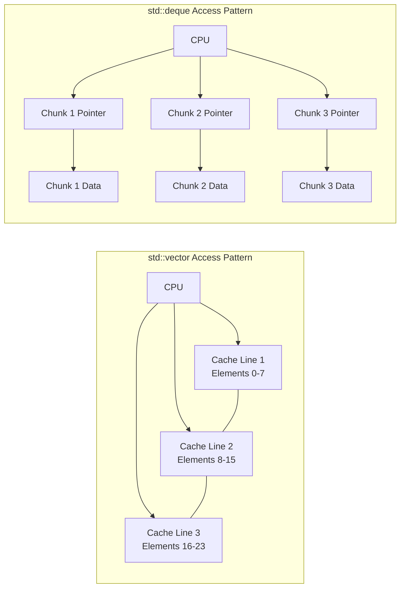
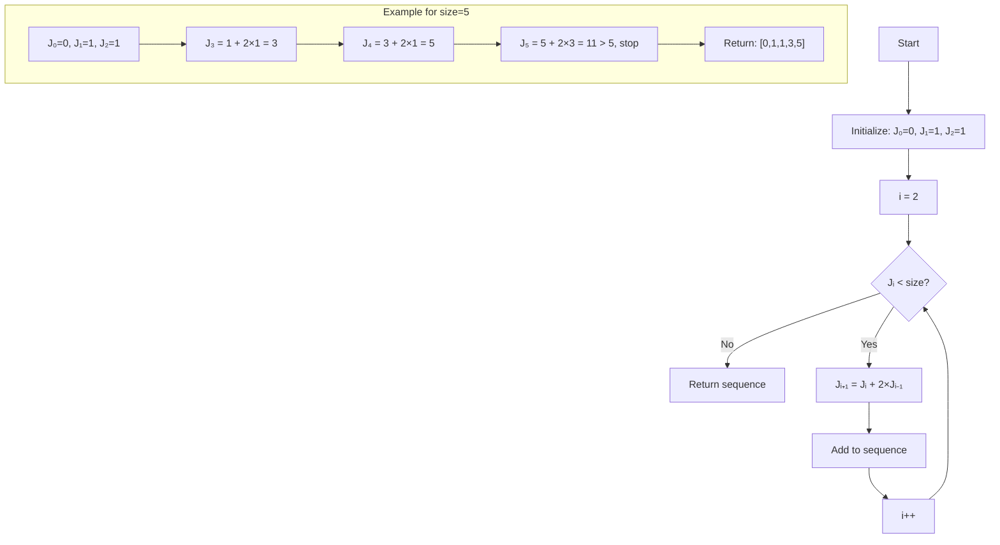
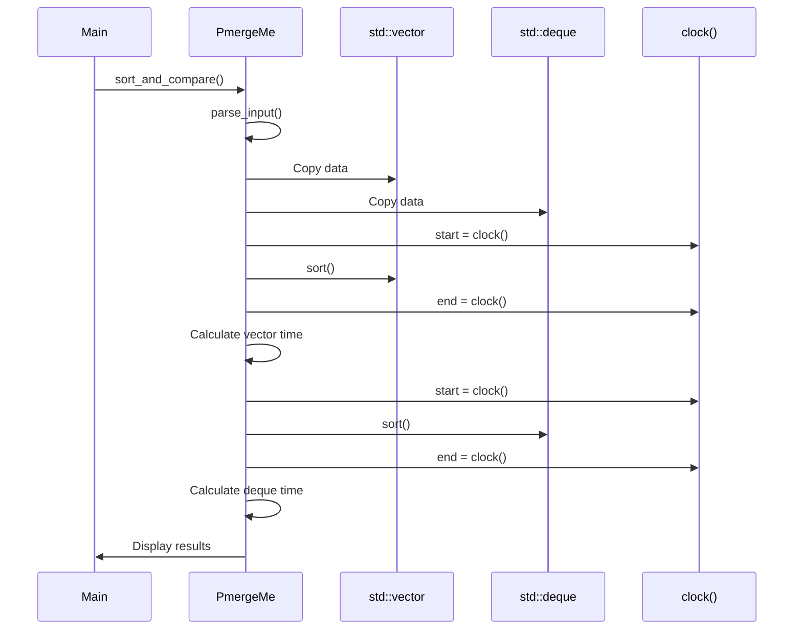
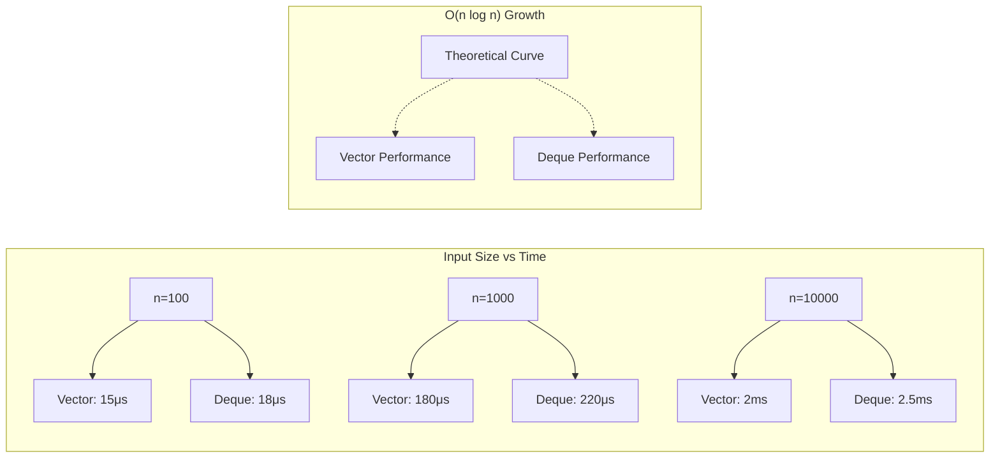

# Exercise-Specific Workflows and Diagrams

## Exercise 00: Bitcoin Exchange - Complete Workflow

### Main Program Flow

```mermaid
graph TD
    A[./btc input.txt] --> B{argc == 2?}
    B -->|No| C[ERROR: wrong number of args]
    B -->|Yes| D[Create BitcoinExchange object]
    D --> E[upload_csv_file()]
    E --> F{CSV loaded?}
    F -->|No| G[ERROR: Can't open CSV]
    F -->|Yes| H[procces_input(filename)]
    H --> I[Process each line]
    I --> J[Output results]
    J --> K[Exit]
    C --> L[return 1]
    G --> L
```

### Detailed File Processing



### Data Structure Deep Dive



---

## Exercise 01: RPN Calculator - Stack Operations

### Expression Evaluation Flow

```mermaid
graph TD
    A[Input: "8 9 * 9 - 9 - 9 - 4 - 1 +"] --> B[Split by spaces]
    B --> C[Token Array: 8,9,*,9,-,9,-,9,-,4,-,1,+]
    C --> D[Initialize Stack]
    D --> E[Process Token 0: '8']
    
    E --> F{Is Digit?}
    F -->|Yes| G[Push 8]
    F -->|No| H[Pop 2, Calculate, Push Result]
    
    G --> I[Stack: [8]]
    I --> J[Next Token]
    J --> K[Process Token 1: '9']
    K --> L[Push 9]
    L --> M[Stack: [8,9]]
    M --> N[Process Token 2: '*']
    N --> O[Pop 9, Pop 8]
    O --> P[Calculate: 8 * 9 = 72]
    P --> Q[Push 72]
    Q --> R[Stack: [72]]
    R --> S[Continue...]
```

### Stack State Visualization

```mermaid
graph LR
    subgraph "Token Processing"
        A["8" → Stack: [8]]
        B["9" → Stack: [8,9]]
        C["*" → Pop(9,8) → 8*9=72 → Stack: [72]]
        D["9" → Stack: [72,9]]
        E["-" → Pop(9,72) → 72-9=63 → Stack: [63]]
        F["9" → Stack: [63,9]]
        G["-" → Pop(9,63) → 63-9=54 → Stack: [54]]
        H["9" → Stack: [54,9]]
        I["-" → Pop(9,54) → 54-9=45 → Stack: [45]]
        J["4" → Stack: [45,4]]
        K["-" → Pop(4,45) → 45-4=41 → Stack: [41]]
        L["1" → Stack: [41,1]]
        M["+" → Pop(1,41) → 41+1=42 → Stack: [42]]
    end
    
    A --> B --> C --> D --> E --> F --> G --> H --> I --> J --> K --> L --> M
```

### Error Handling Flowchart



---

## Exercise 02: Ford-Johnson Algorithm - Detailed Analysis

### Algorithm Execution Steps



### Container Comparison Workflow

```mermaid
graph TD
    A[Parse Input Arguments] --> B[Create std::vector copy]
    A --> C[Create std::deque copy]
    
    B --> D[Start Vector Timer]
    C --> E[Start Deque Timer]
    
    D --> F[sort(vector)]
    E --> G[sort(deque)]
    
    F --> H[End Vector Timer]
    G --> I[End Deque Timer]
    
    H --> J[Calculate Vector Time]
    I --> K[Calculate Deque Time]
    
    J --> L[Display Results]
    K --> L
```

### Memory Access Patterns



### Jacobsthal Number Generation



### Performance Measurement Process



---

## Complexity Analysis Diagrams

### Time Complexity Comparison



### Memory Usage Patterns

```mermaid
graph TD
    subgraph "BitcoinExchange Memory"
        A[std::map<br/>~40 bytes per entry]
        B[Key: string (date)]
        C[Value: double (price)]
        D[Node overhead]
        A --> B
        A --> C
        A --> D
    end
    
    subgraph "RPN Calculator Memory"
        E[std::stack<br/>Dynamic size]
        F[Underlying container<br/>(default: std::deque)]
        G[Elements: int (4 bytes each)]
        E --> F
        F --> G
    end
    
    subgraph "PmergeMe Memory"
        H[Original data]
        I[Vector copy]
        J[Deque copy]
        K[Temporary arrays]
        H --> I
        H --> J
        I --> K
        J --> K
    end
```

This comprehensive workflow analysis shows exactly how your code executes, making it perfect for Obsidian with all the Mermaid diagrams for visualization!