# PmergeMe - Ford-Johnson Merge-Insertion Sort

## Overview
PmergeMe implements the Ford-Johnson merge-insertion sort algorithm, also known as the **optimal merge-insertion sort**. This algorithm is theoretically optimal in terms of the number of comparisons needed to sort a sequence, requiring at most ⌈log₂(n!)⌉ comparisons.

The program demonstrates the algorithm using two STL containers (`std::vector` and `std::deque`) and compares their performance.

## Algorithm Description

The Ford-Johnson algorithm combines the efficiency of merge sort with the optimal insertion strategy using Jacobsthal numbers. It operates in three main phases:

### Phase 1: Pair Formation and Comparison
- Group elements into pairs
- Compare each pair and separate larger and smaller elements
- Handle odd element separately if present

### Phase 2: Recursive Sorting
- Recursively sort the sequence of larger elements
- This creates a sorted "main chain"

### Phase 3: Optimal Insertion
- Insert smaller elements into the main chain using Jacobsthal sequence
- Use binary search for efficient insertion

## Jacobsthal Numbers

The key to the algorithm's optimality lies in the Jacobsthal sequence:
- J(0) = 0
- J(1) = 1  
- J(n) = J(n-1) + 2×J(n-2)

Sequence: 0, 1, 1, 3, 5, 11, 21, 43, 85, 171...

### Jacobsthal Sequence Generation Diagram

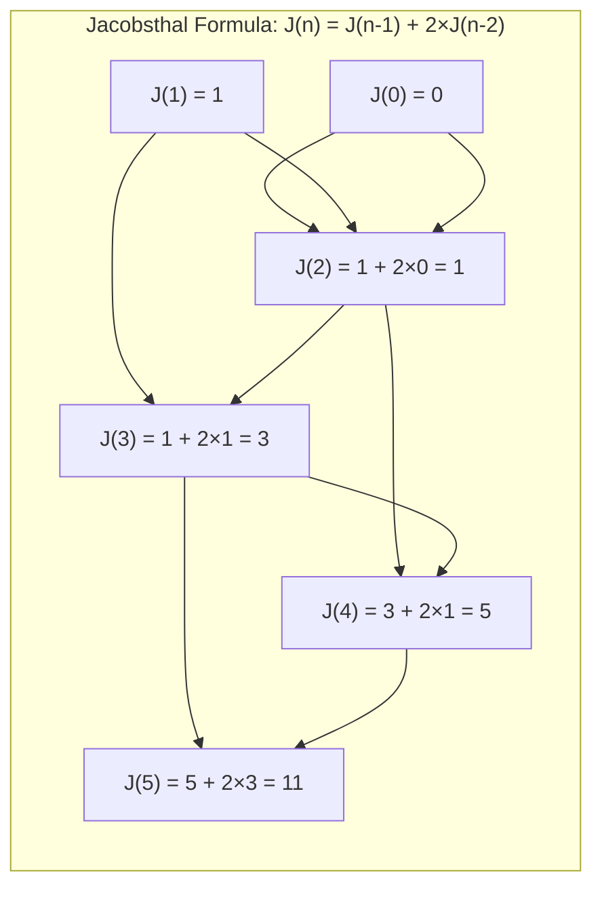

### Why Jacobsthal? The Optimality Secret

```
┌─────────────────────────────────────────────────────────────────────┐
│                    BINARY SEARCH OPTIMIZATION                        │
├─────────────────────────────────────────────────────────────────────┤
│                                                                      │
│  Binary search on array of size N needs ⌈log₂(N)⌉ comparisons       │
│                                                                      │
│  Jacobsthal order ensures we always search in POWER OF 2 ranges!    │
│                                                                      │
│  Example: Inserting into sorted array of size 7                     │
│                                                                      │
│  Sequential order: Search in 7, 8, 9, 10... elements (inefficient)  │
│  Jacobsthal order: Search in 2, 4, 8, 16... elements (optimal!)     │
│                                                                      │
│  ┌───┬───┬───┬───┬───┬───┬───┐                                      │
│  │ 1 │ 2 │ 3 │ 4 │ 5 │ 6 │ 7 │  ← Main chain positions             │
│  └───┴───┴───┴───┴───┴───┴───┘                                      │
│    ↑       ↑               ↑                                         │
│    │       │               └── Insert 3rd (search in 4 elements)    │
│    │       └────────────────── Insert 2nd (search in 2 elements)    │
│    └────────────────────────── Insert 1st (search in 1 element)     │
│                                                                      │
└─────────────────────────────────────────────────────────────────────┘
```

### Jacobsthal Numbers Calculation Table

| n | Formula | Calculation | Result |
|---|---------|-------------|--------|
| 0 | Base case | - | **0** |
| 1 | Base case | - | **1** |
| 2 | J(1) + 2×J(0) | 1 + 2×0 | **1** |
| 3 | J(2) + 2×J(1) | 1 + 2×1 | **3** |
| 4 | J(3) + 2×J(2) | 3 + 2×1 | **5** |
| 5 | J(4) + 2×J(3) | 5 + 2×3 | **11** |
| 6 | J(5) + 2×J(4) | 11 + 2×5 | **21** |
| 7 | J(6) + 2×J(5) | 21 + 2×11 | **43** |

## Visual Algorithm Flow

### Complete Algorithm State Machine

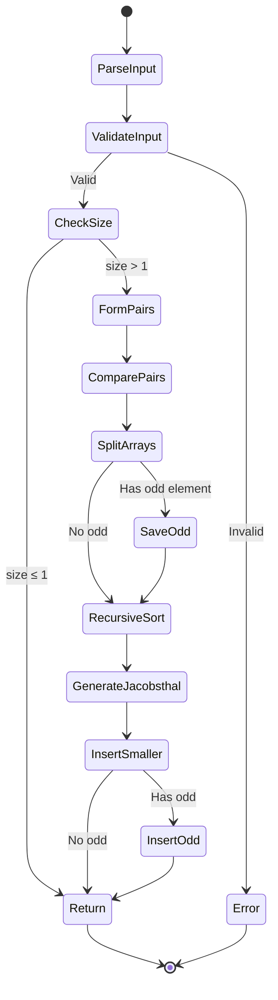

### Pair Formation Process

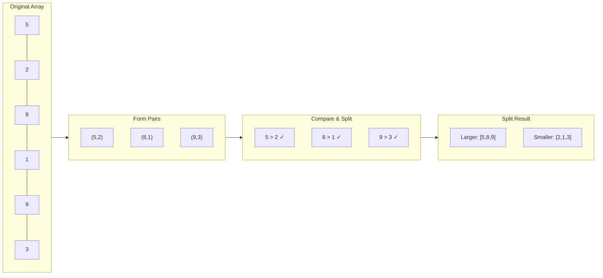

### Example: Sorting [5, 2, 8, 1, 9, 3]

#### Step 1: Pair Formation
```
Original: [5, 2, 8, 1, 9, 3]
          ↓    ↓    ↓
Pairs:   (5,2) (8,1) (9,3)
          ↓    ↓    ↓
Compare: 5>2   8>1   9>3

Larger:  [5,   8,   9]
Smaller: [2,   1,   3]
```

#### Step 2: Recursive Sort of Larger Elements
```
Larger: [5, 8, 9] → [5, 8, 9] (already sorted)
Main Chain: [5, 8, 9]
```

#### Step 3: Jacobsthal-Ordered Insertion
```
Jacobsthal for size 3: [0, 1, 1, 3]
Groups: [0], [1], [1-3] → [0], [1], [3,2] (reversed)

Insert smaller[0] = 2:
  Main chain: [5, 8, 9]
  Insert 2: [2, 5, 8, 9]

Insert smaller[1] = 1:
  Main chain: [2, 5, 8, 9]
  Insert 1: [1, 2, 5, 8, 9]

Insert smaller[2] = 3:
  Main chain: [1, 2, 5, 8, 9]
  Insert 3: [1, 2, 3, 5, 8, 9]

Final: [1, 2, 3, 5, 8, 9]
```

---

## Detailed Example: Sorting [21, 5, 8, 17, 3, 12, 1]

This example shows how the algorithm handles an **odd number of elements**.

### Step-by-Step Breakdown

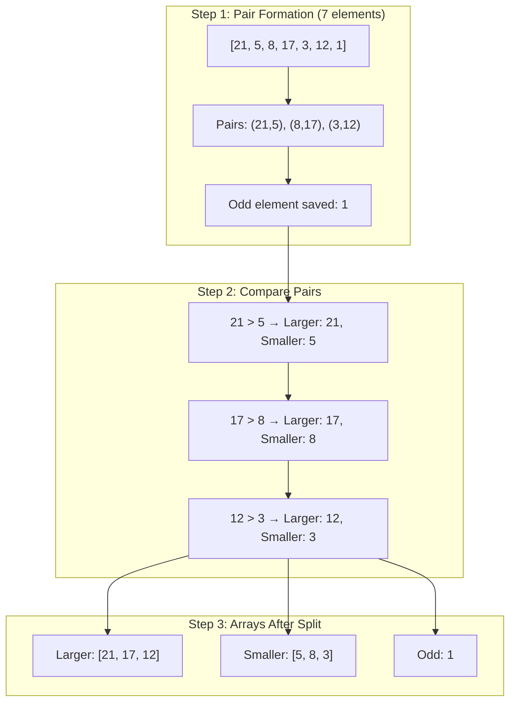

### Recursive Sorting of Larger Array

```
┌────────────────────────────────────────────────────────────────────┐
│                    RECURSION DEPTH 1                                │
├────────────────────────────────────────────────────────────────────┤
│  Input: [21, 17, 12]                                               │
│                                                                     │
│  Pairs: (21, 17)         Odd: 12                                   │
│  Compare: 21 > 17                                                   │
│  Larger: [21]            Smaller: [17]                             │
│                                                                     │
│  ┌─────────────────────────────────────────────────────────────┐   │
│  │                  RECURSION DEPTH 2                           │   │
│  ├─────────────────────────────────────────────────────────────┤   │
│  │  Input: [21]                                                 │   │
│  │  Size ≤ 1 → Return [21]                                     │   │
│  └─────────────────────────────────────────────────────────────┘   │
│                                                                     │
│  Main chain: [21]                                                  │
│  Insert 17: Binary search → [17, 21]                              │
│  Insert odd 12: Binary search → [12, 17, 21]                      │
│                                                                     │
│  Return: [12, 17, 21]                                              │
└────────────────────────────────────────────────────────────────────┘

Sorted Larger: [12, 17, 21]
```

### Jacobsthal Insertion of Smaller Elements

```
Smaller array: [5, 8, 3] (corresponds to indices 0, 1, 2)
Main chain after recursive sort: [12, 17, 21]

Jacobsthal sequence for size 3: [0, 1, 1, 3]

┌──────────────────────────────────────────────────────────────────────┐
│                    JACOBSTHAL INSERTION ORDER                         │
├──────────────────────────────────────────────────────────────────────┤
│                                                                       │
│  Jacobsthal: [0, 1, 1, 3]                                            │
│                                                                       │
│  Group 1: indices [0] → insert smaller[0] = 5                        │
│  Group 2: indices [1] → insert smaller[1] = 8                        │
│  Group 3: indices [1, 3) reversed → [2] → insert smaller[2] = 3     │
│                                                                       │
│  Processing Order: 0 → 1 → 2                                         │
│                                                                       │
└──────────────────────────────────────────────────────────────────────┘

Insertion Process:
═══════════════════

① Insert smaller[0] = 5 into [12, 17, 21]
   Binary search: 5 < 12 → position 0
   Result: [5, 12, 17, 21]

② Insert smaller[1] = 8 into [5, 12, 17, 21]
   Binary search: 5 < 8 < 12 → position 1
   Result: [5, 8, 12, 17, 21]

③ Insert smaller[2] = 3 into [5, 8, 12, 17, 21]
   Binary search: 3 < 5 → position 0
   Result: [3, 5, 8, 12, 17, 21]

④ Insert odd element = 1 into [3, 5, 8, 12, 17, 21]
   Binary search: 1 < 3 → position 0
   Result: [1, 3, 5, 8, 12, 17, 21]

FINAL SORTED ARRAY: [1, 3, 5, 8, 12, 17, 21] ✓
```

---

## Larger Example: 10 Elements [45, 12, 78, 34, 5, 89, 23, 67, 9, 56]

### Visual Trace

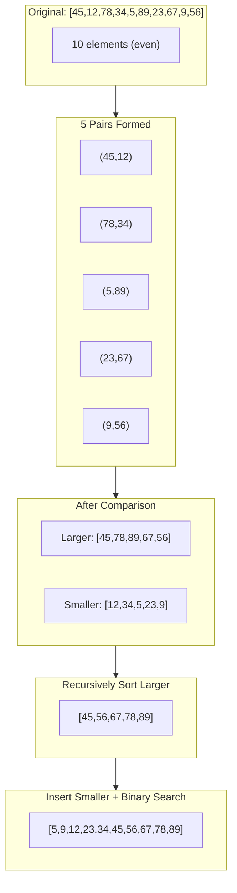

### Jacobsthal Order for 5 Elements

```
Jacobsthal sequence: [0, 1, 1, 3, 5]

smaller array indices:    0    1    2    3    4
smaller array values:    12   34    5   23    9

Insertion Order by Jacobsthal:
┌─────────────────────────────────────────────────────────────────┐
│  Round 1: Group [0, 1)      → index 0   → insert 12            │
│  Round 2: Group [1, 1)      → (empty, skip)                     │
│  Round 3: Group [1, 3) rev  → indices 2,1 → insert 5, then 34  │
│  Round 4: Group [3, 5) rev  → indices 4,3 → insert 9, then 23  │
└─────────────────────────────────────────────────────────────────┘

Actual order: 12 → 5 → 34 → 9 → 23
(Notice: groups are processed in REVERSE order within each range!)
```

---

## Binary Search Insertion Visualization

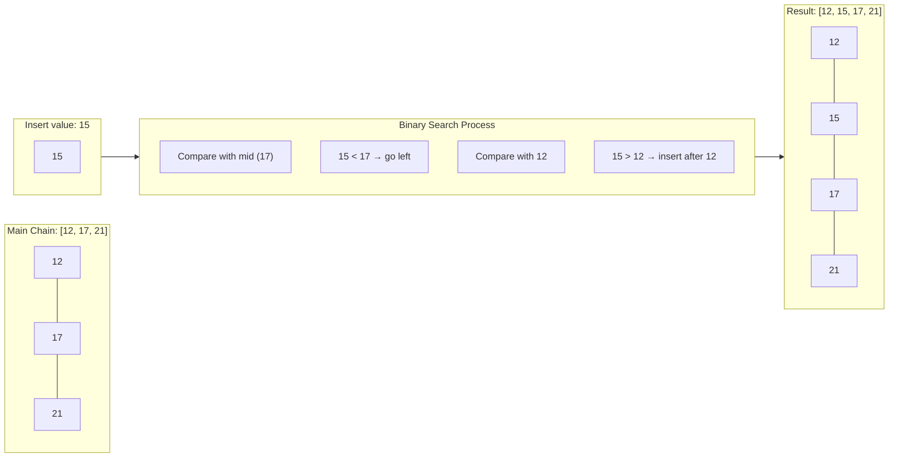

### Binary Search Detail

```
┌────────────────────────────────────────────────────────────────────┐
│              BINARY SEARCH: Insert 15 into [12, 17, 21]            │
├────────────────────────────────────────────────────────────────────┤
│                                                                     │
│  Array: [12, 17, 21]                                               │
│  Target: 15                                                         │
│                                                                     │
│  Step 1: left=0, right=3, mid=1                                    │
│          ┌────┬────┬────┐                                          │
│          │ 12 │ 17 │ 21 │                                          │
│          └────┴────┴────┘                                          │
│            ↑    ↑                                                  │
│          left  mid                                                 │
│          15 < 17 → right = mid = 1                                 │
│                                                                     │
│  Step 2: left=0, right=1, mid=0                                    │
│          ┌────┬────┬────┐                                          │
│          │ 12 │ 17 │ 21 │                                          │
│          └────┴────┴────┘                                          │
│            ↑                                                       │
│          left=mid                                                  │
│          15 > 12 → left = mid + 1 = 1                              │
│                                                                     │
│  Step 3: left=1, right=1 → left == right → STOP                   │
│          Insert position: 1                                         │
│                                                                     │
│  Result: [12, 15, 17, 21]                                          │
│                ↑                                                   │
│           inserted here                                             │
│                                                                     │
└────────────────────────────────────────────────────────────────────┘
```

---

## Recursion Tree Visualization

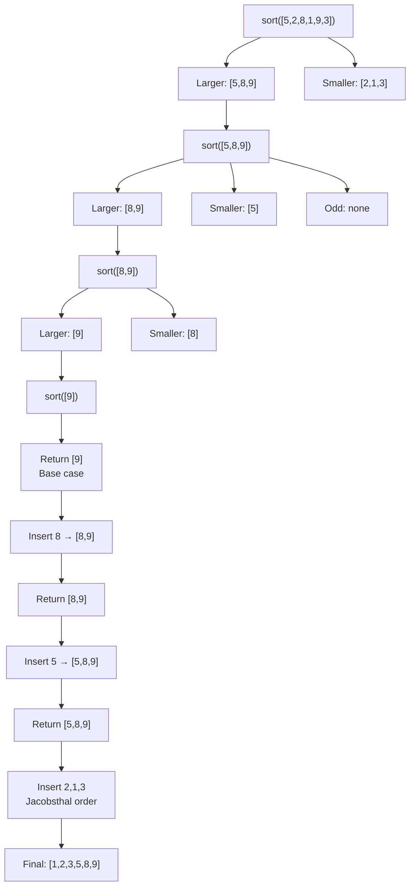

### Complete Algorithm Visualization

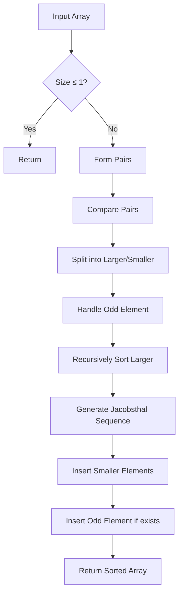

### Jacobsthal Insertion Order Diagram

```
For array size n=6, Jacobsthal numbers: [0, 1, 1, 3, 5]

Insertion order visualization:
┌─────┬─────┬─────┬─────┬─────┬─────┐
│  0  │  1  │  2  │  3  │  4  │  5  │ ← Index
├─────┼─────┼─────┼─────┼─────┼─────┤
│  1  │  2  │  4  │  3  │  6  │  5  │ ← Insertion Order
└─────┴─────┴─────┴─────┴─────┴─────┘
   ↑     ↑     ↑     ↑     ↑     ↑
   │     │     │     │     │     └── 5th (group [3,5] reversed)
   │     │     │     │     └──────── 6th (group [3,5] reversed)
   │     │     │     └────────────── 3rd (group [1,3] reversed)
   │     │     └──────────────────── 4th (group [1,3] reversed)
   │     └────────────────────────── 2nd (group [1,1])
   └──────────────────────────────── 1st (group [0,1])
```

### Understanding Jacobsthal Group Processing

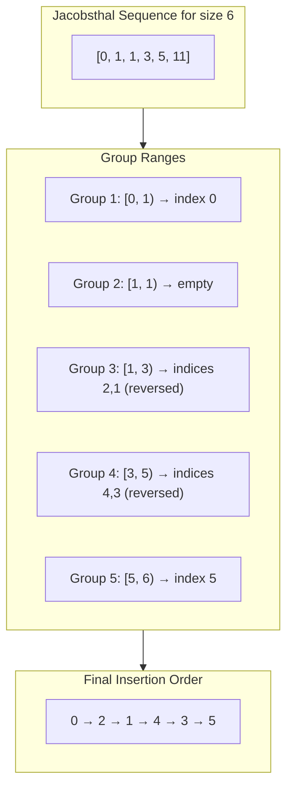

---

## Jacobsthal Logic Deep Dive

### Why Reverse Order Within Groups?

```
┌──────────────────────────────────────────────────────────────────────────┐
│                    THE REVERSAL OPTIMIZATION                              │
├──────────────────────────────────────────────────────────────────────────┤
│                                                                           │
│  When inserting elements from a Jacobsthal group [start, end):           │
│  We insert in REVERSE order (end-1, end-2, ..., start)                   │
│                                                                           │
│  WHY? Because each element we insert EXPANDS the search range!           │
│                                                                           │
│  Example: Main chain = [10, 20, 30, 40]                                  │
│           To insert: smaller[1]=15, smaller[2]=25                        │
│                                                                           │
│  If we insert 15 first:                                                  │
│    Chain becomes: [10, 15, 20, 30, 40]  (size 5)                         │
│    Now inserting 25 needs to search in 5 elements!                       │
│                                                                           │
│  If we insert 25 first (reverse order):                                  │
│    Chain becomes: [10, 20, 25, 30, 40]  (size 5)                         │
│    But we planned for this! Binary search still optimal.                 │
│                                                                           │
│  The math works out so that reversed insertion within groups             │
│  maintains the power-of-2 search boundaries!                             │
│                                                                           │
└──────────────────────────────────────────────────────────────────────────┘
```

### Jacobsthal vs Sequential Comparison

```
┌────────────────────────────────────────────────────────────────────────┐
│                 COMPARISON: Sequential vs Jacobsthal                    │
├────────────────────────────────────────────────────────────────────────┤
│                                                                         │
│  Sorting 8 elements → 4 pairs → 4 elements to insert                   │
│                                                                         │
│  SEQUENTIAL ORDER (0, 1, 2, 3):                                        │
│  ┌─────────────────────────────────────────────────────────────────┐   │
│  │  Insert[0]: search in 4 elements  → ⌈log₂(4)⌉ = 2 comparisons  │   │
│  │  Insert[1]: search in 5 elements  → ⌈log₂(5)⌉ = 3 comparisons  │   │
│  │  Insert[2]: search in 6 elements  → ⌈log₂(6)⌉ = 3 comparisons  │   │
│  │  Insert[3]: search in 7 elements  → ⌈log₂(7)⌉ = 3 comparisons  │   │
│  │  TOTAL: 2 + 3 + 3 + 3 = 11 comparisons                          │   │
│  └─────────────────────────────────────────────────────────────────┘   │
│                                                                         │
│  JACOBSTHAL ORDER (0, 1, 3, 2):                                        │
│  ┌─────────────────────────────────────────────────────────────────┐   │
│  │  Insert[0]: search in 4 elements  → ⌈log₂(4)⌉ = 2 comparisons  │   │
│  │  Insert[1]: search in 5 elements  → ⌈log₂(5)⌉ = 3 comparisons  │   │
│  │  Insert[3]: search in 6 elements  → ⌈log₂(6)⌉ = 3 comparisons  │   │
│  │  Insert[2]: search in 4 elements  → ⌈log₂(4)⌉ = 2 comparisons  │   │
│  │  TOTAL: 2 + 3 + 3 + 2 = 10 comparisons  ← FEWER!               │   │
│  └─────────────────────────────────────────────────────────────────┘   │
│                                                                         │
│  Savings: 1 comparison (grows larger with more elements!)              │
│                                                                         │
└────────────────────────────────────────────────────────────────────────┘
```

### Complete Jacobsthal Order Generation (Code Logic)

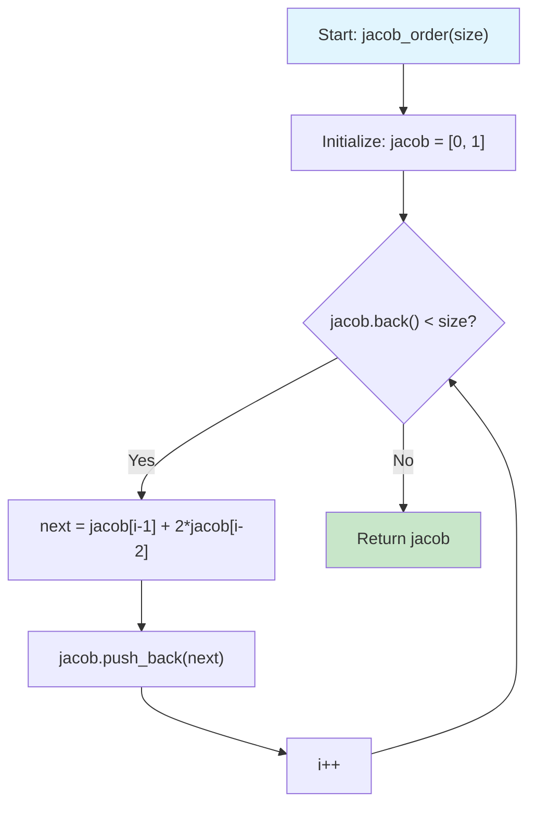

---

## Memory Layout Comparison

### std::vector vs std::deque

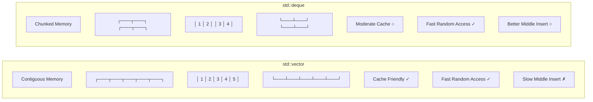

### Performance Characteristics

```
┌─────────────────────────────────────────────────────────────────────┐
│              CONTAINER PERFORMANCE FOR FORD-JOHNSON                  │
├─────────────────────────────────────────────────────────────────────┤
│                                                                      │
│  Operation          │ std::vector │ std::deque │ Winner             │
│  ──────────────────────────────────────────────────────────────────│
│  Random Access      │    O(1)     │    O(1)    │    Tie            │
│  Binary Search      │   Faster*   │   Slower   │   vector          │
│  Middle Insertion   │    O(n)     │    O(n)    │   deque           │
│  Memory Overhead    │    Low      │   Higher   │   vector          │
│  Cache Efficiency   │   Better    │   Worse    │   vector          │
│                                                                      │
│  * Due to memory locality                                           │
│                                                                      │
│  CONCLUSION: std::vector usually wins for Ford-Johnson!             │
│                                                                      │
└─────────────────────────────────────────────────────────────────────┘
```

## Implementation Details

### Container Comparison
The program implements the same algorithm for two different containers:

#### std::vector
- **Pros**: Contiguous memory, cache-friendly, random access
- **Cons**: Expensive insertions in the middle

#### std::deque
- **Pros**: Efficient insertions at both ends, relatively efficient middle insertions
- **Cons**: Non-contiguous memory, more complex memory layout

### Time Complexity Analysis
```
Best Case:    O(n log n)
Average Case: O(n log n)
Worst Case:   O(n log n)

Comparisons: ≤ ⌈log₂(n!)⌉ (optimal)
```

### Performance Measurement
The program measures execution time in microseconds for both containers:
```cpp
double calcule_vector_time(std::vector<int> &vec);
double calcule_deque_time(std::deque<int> &deq);
```

## Usage

### Compilation
```bash
make
```

### Execution
```bash
./PmergeMe [positive integers...]
```

### Examples
```bash
# Example 1: Small sequence
./PmergeMe 3 5 9 7 4
Before: 3 5 9 7 4
After: 3 4 5 7 9
Time for 5 elements with std::vector : 42 us
Time for 5 elements with std::deque : 48 us

# Example 2: Larger sequence
./PmergeMe 41 67 34 0 69 24 78 58 62 64 5 45 81 27 61
Before: 41 67 34 0 69 24 78 58 62 64 5 45 81 27 61
After: 0 5 24 27 34 41 45 58 61 62 64 67 69 78 81
Time for 15 elements with std::vector : 124 us
Time for 15 elements with std::deque : 156 us
```

## Error Handling

The program validates input and provides appropriate error messages:

- **No arguments**: "Error: No input"
- **Invalid characters**: "Error: Invalid input"
- **Negative numbers**: Rejected during parsing

```bash
# Invalid examples
./PmergeMe            # Error: No input
./PmergeMe -5 3 7     # Error: Invalid input
./PmergeMe 3 4.5 7    # Error: Invalid input
./PmergeMe 3 abc 7    # Error: Invalid input
```

## Algorithm Optimality

The Ford-Johnson algorithm is proven to be optimal for:
- **n ≤ 21**: Uses minimum number of comparisons
- **n > 21**: Very close to optimal, often within 1-2 comparisons

### Comparison Count Table
| n | Optimal | Ford-Johnson | Difference |
|---|---------|--------------|------------|
| 3 | 3       | 3            | 0          |
| 4 | 5       | 5            | 0          |
| 5 | 7       | 7            | 0          |
| 10| 22      | 22           | 0          |
| 20| 62      | 62           | 0          |

## Key Features

1. **Theoretical Optimality**: Minimum comparisons for small arrays
2. **Dual Container Support**: Benchmarks `std::vector` vs `std::deque`
3. **Robust Input Validation**: Comprehensive error checking
4. **Precise Timing**: Microsecond-level performance measurement
5. **Memory Efficiency**: Recursive implementation with controlled depth

## Files Structure

```
ex02/
├── PmergeMe.hpp      # Class declaration
├── PmergeMe.cpp      # Algorithm implementation  
├── main.cpp          # Program entry point
├── Makefile          # Build configuration
└── README.md         # This documentation
```

## Technical Notes

### Jacobsthal Generation
```cpp
std::vector<int> jacob_order(int size) {
    std::vector<int> jacob;
    jacob.push_back(0);
    jacob.push_back(1);
    
    int i = 2;
    while (jacob.back() < size) {
        int next = jacob[i-1] + 2 * jacob[i-2];
        jacob.push_back(next);
        i++;
    }
    return jacob;
}
```

### Binary Search Insertion
```cpp
// Find optimal insertion position
std::vector<int>::iterator pos = 
    std::lower_bound(larger.begin(), larger.end(), element);
larger.insert(pos, element);
```

## Performance Expectations

Generally, `std::vector` outperforms `std::deque` for this algorithm due to:
- Better cache locality during binary search
- More efficient memory access patterns
- Lower overhead for small to medium-sized arrays

However, `std::deque` may show competitive performance for:
- Very large arrays where insertion costs dominate
- Systems with specific memory architectures
- Scenarios with frequent insertions

---

*This implementation demonstrates the elegance and efficiency of the Ford-Johnson algorithm while providing practical insights into STL container performance characteristics.*

---

## Quick Reference Cards

### Algorithm at a Glance

```
┌────────────────────────────────────────────────────────────────────────┐
│                    FORD-JOHNSON CHEAT SHEET                             │
├────────────────────────────────────────────────────────────────────────┤
│                                                                         │
│  1. PAIR & COMPARE                                                     │
│     [a,b,c,d,e,f] → pairs (a,b)(c,d)(e,f)                             │
│     Split into: Larger[] and Smaller[]                                 │
│                                                                         │
│  2. RECURSIVELY SORT LARGER                                            │
│     Keep calling until size ≤ 1                                        │
│                                                                         │
│  3. INSERT SMALLER (Jacobsthal Order)                                  │
│     Generate Jacobsthal: 0,1,1,3,5,11,21...                           │
│     Insert in groups, reversed within group                            │
│     Use binary search for O(log n) insertion                           │
│                                                                         │
│  4. HANDLE ODD ELEMENT                                                 │
│     If original size was odd, insert last element                      │
│                                                                         │
│  Time: O(n log n)  |  Comparisons: ≤ ⌈log₂(n!)⌉                       │
│                                                                         │
└────────────────────────────────────────────────────────────────────────┘
```

### Jacobsthal Quick Reference

```
┌────────────────────────────────────────────────────────────────────────┐
│                    JACOBSTHAL QUICK REFERENCE                           │
├────────────────────────────────────────────────────────────────────────┤
│                                                                         │
│  Formula: J(n) = J(n-1) + 2×J(n-2)                                     │
│                                                                         │
│  Sequence:  0   1   1   3   5  11  21  43  85  171  341  683          │
│  Index:     0   1   2   3   4   5   6   7   8    9   10   11          │
│                                                                         │
│  Group Processing:                                                      │
│  ┌──────────────────────────────────────────────────────────────┐     │
│  │  For each adjacent pair (jacob[i], jacob[i+1]):              │     │
│  │    → Process indices from jacob[i+1]-1 down to jacob[i]      │     │
│  │    → This is the REVERSE order!                              │     │
│  └──────────────────────────────────────────────────────────────┘     │
│                                                                         │
│  Example for size 5:                                                   │
│    Jacobsthal: [0, 1, 1, 3, 5]                                        │
│    Groups: [0,1) [1,1) [1,3) [3,5)                                    │
│    Order:   0     -    2,1   4,3                                       │
│                                                                         │
└────────────────────────────────────────────────────────────────────────┘
```

### Common Pitfalls

```
┌────────────────────────────────────────────────────────────────────────┐
│                       ⚠️  COMMON MISTAKES                               │
├────────────────────────────────────────────────────────────────────────┤
│                                                                         │
│  ❌ Forgetting to handle odd elements                                  │
│     → Always check if n % 2 != 0                                       │
│                                                                         │
│  ❌ Inserting in sequential order instead of Jacobsthal               │
│     → Loses the optimal comparison guarantee                           │
│                                                                         │
│  ❌ Not reversing within Jacobsthal groups                            │
│     → Breaks the power-of-2 search optimization                        │
│                                                                         │
│  ❌ Using O(n) search instead of binary search                        │
│     → Destroys time complexity                                         │
│                                                                         │
│  ❌ Not handling base case (size ≤ 1)                                 │
│     → Infinite recursion                                               │
│                                                                         │
└────────────────────────────────────────────────────────────────────────┘
```

---

## Visual Summary

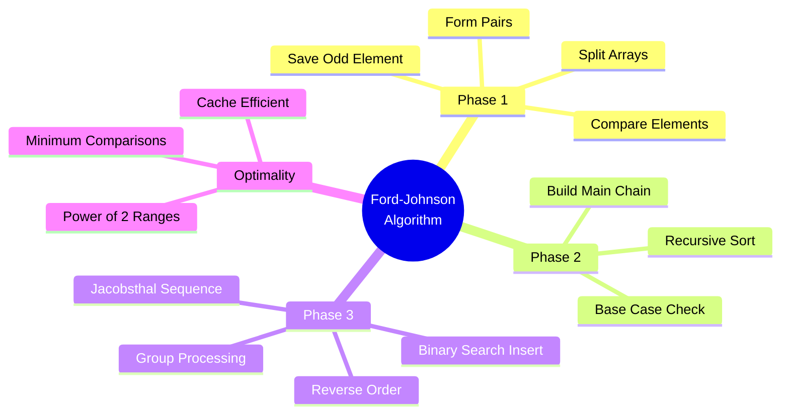
