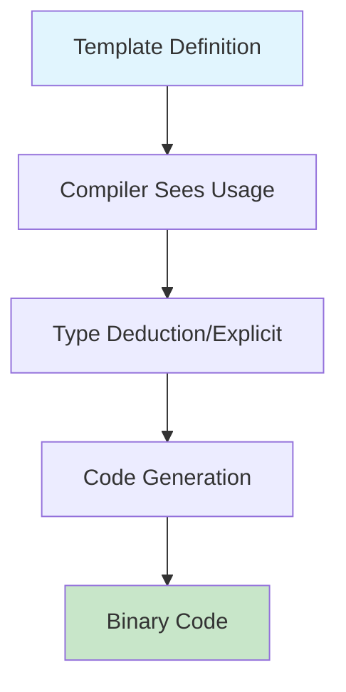

# C++ Templates Complete Guide

---

## 📋 Table of Contents

- [[#🎯 Template Fundamentals|Template Fundamentals]]
- [[#🔧 Function Templates|Function Templates]]
- [[#🏗️ Class Templates|Class Templates]]
- [[#⚡ Template Specialization|Template Specialization]]
- [[#🎨 Advanced Template Concepts|Advanced Template Concepts]]
- [[#📚 Standard Template Library (STL)|Standard Template Library]]
- [[#🛠️ Template Metaprogramming|Template Metaprogramming]]
- [[#💡 Best Practices & Common Pitfalls|Best Practices]]

---

## 🎯 Template Fundamentals

> [!NOTE] Core Concept
> **Templates** enable **generic programming** - writing code that works with **any data type** while maintaining **type safety** and **zero runtime overhead**.

### Template Syntax

```cpp
template <typename T>        // Modern C++98+ style
template <class T>           // Legacy style (same meaning)
template <typename T, typename U>  // Multiple type parameters
```

### Key Benefits

- ✅ **Code Reusability** - Write once, use everywhere
- ✅ **Type Safety** - Compile-time type checking
- ✅ **Performance** - Zero runtime overhead
- ✅ **Flexibility** - Automatic type deduction

### Template Instantiation Process



---

## 🔧 Function Templates

### Basic Function Template

```cpp
template <typename T>
void swap_values(T& a, T& b) {
    T temp = a;
    a = b;
    b = temp;
}

// Usage
int x = 10, y = 20;
swap_values(x, y);           // T = int (deduced)
swap_values<double>(3.14, 2.71);  // T = double (explicit)
```

### Template Argument Deduction

```cpp
template <typename T>
T max_value(T a, T b) {
    return (a > b) ? a : b;
}

// Automatic deduction
int result1 = max_value(10, 20);        // T = int
double result2 = max_value(3.14, 2.71); // T = double

// Mixed types - compilation error!
// auto result3 = max_value(10, 3.14);  // ERROR: T can't be both int and double
```

### Multiple Template Parameters

```cpp
template <typename T, typename U>
auto add(T a, U b) -> decltype(a + b) {  // C++11 trailing return type
    return a + b;
}

template <typename T, typename U>
void print_pair(const T& first, const U& second) {
    std::cout << "(" << first << ", " << second << ")" << std::endl;
}

// Usage
auto result = add(10, 3.14);           // Returns double
print_pair("Age", 25);                 // T=const char*, U=int
print_pair<std::string, int>("Score", 95);  // Explicit types
```

### Function Template with Non-Type Parameters

```cpp
template <typename T, size_t N>
void print_array(const T (&arr)[N]) {
    std::cout << "Array of " << N << " elements: ";
    for (size_t i = 0; i < N; ++i) {
        std::cout << arr[i] << " ";
    }
    std::cout << std::endl;
}

// Usage
int numbers[] = {1, 2, 3, 4, 5};
print_array(numbers);  // N = 5 (deduced from array size)
```

---

## 🏗️ Class Templates

### Basic Class Template

```cpp
template <typename T>
class Stack {
private:
    std::vector<T> elements;
    
public:
    void push(const T& element) {
        elements.push_back(element);
    }
    
    T pop() {
        if (elements.empty()) {
            throw std::runtime_error("Stack is empty");
        }
        T top = elements.back();
        elements.pop_back();
        return top;
    }
    
    bool empty() const {
        return elements.empty();
    }
    
    size_t size() const {
        return elements.size();
    }
};

// Usage
Stack<int> int_stack;
Stack<std::string> string_stack;

int_stack.push(42);
string_stack.push("Hello");
```

### Class Template with Multiple Parameters

```cpp
template <typename KeyType, typename ValueType>
class KeyValuePair {
private:
    KeyType key;
    ValueType value;
    
public:
    KeyValuePair(const KeyType& k, const ValueType& v) 
        : key(k), value(v) {}
    
    KeyType getKey() const { return key; }
    ValueType getValue() const { return value; }
    
    void setValue(const ValueType& v) { value = v; }
    
    void print() const {
        std::cout << key << " => " << value << std::endl;
    }
};

// Usage
KeyValuePair<std::string, int> age("Alice", 30);
KeyValuePair<int, double> coordinate(10, 3.14);

age.print();        // Alice => 30
coordinate.print(); // 10 => 3.14
```

### Template Member Functions

```cpp
template <typename T>
class Container {
private:
    std::vector<T> data;
    
public:
    void add(const T& item) { data.push_back(item); }
    
    // Template member function
    template <typename U>
    void addConverted(const U& item) {
        data.push_back(static_cast<T>(item));
    }
    
    // Template member function for iteration
    template <typename Func>
    void forEach(Func func) {
        for (T& item : data) {
            func(item);
        }
    }
};

// Usage
Container<double> container;
container.add(3.14);
container.addConverted(42);     // int -> double conversion
container.addConverted('A');    // char -> double conversion

container.forEach([](double& x) { x *= 2; });  // Lambda function
```

---

## ⚡ Template Specialization

### Full Specialization

```cpp
// Primary template
template <typename T>
class Printer {
public:
    void print(const T& value) {
        std::cout << "Generic: " << value << std::endl;
    }
};

// Full specialization for const char*
template <>
class Printer<const char*> {
public:
    void print(const char* value) {
        std::cout << "String: \"" << value << "\"" << std::endl;
    }
};

// Full specialization for bool
template <>
class Printer<bool> {
public:
    void print(const bool& value) {
        std::cout << "Boolean: " << (value ? "TRUE" : "FALSE") << std::endl;
    }
};

// Usage
Printer<int> int_printer;
Printer<const char*> string_printer;
Printer<bool> bool_printer;

int_printer.print(42);          // Generic: 42
string_printer.print("Hello");  // String: "Hello"
bool_printer.print(true);       // Boolean: TRUE
```

### Partial Specialization (Class Templates Only)

```cpp
// Primary template
template <typename T, typename U>
class Converter {
public:
    void convert(const T& from, U& to) {
        to = static_cast<U>(from);
        std::cout << "Generic conversion" << std::endl;
    }
};

// Partial specialization: same types
template <typename T>
class Converter<T, T> {
public:
    void convert(const T& from, T& to) {
        to = from;
        std::cout << "Same type assignment" << std::endl;
    }
};

// Partial specialization: pointer types
template <typename T, typename U>
class Converter<T*, U*> {
public:
    void convert(T* const& from, U*& to) {
        to = reinterpret_cast<U*>(from);
        std::cout << "Pointer conversion" << std::endl;
    }
};

// Usage
Converter<int, double> conv1;
Converter<int, int> conv2;
Converter<int*, char*> conv3;

int a = 42;
double b;
conv1.convert(a, b);  // Generic conversion

int c = 10, d;
conv2.convert(c, d);  // Same type assignment
```

### Function Template Specialization

```cpp
// Primary template
template <typename T>
void process(const T& value) {
    std::cout << "Processing: " << value << std::endl;
}

// Explicit specialization for const char*
template <>
void process<const char*>(const char* const& value) {
    std::cout << "Processing string: \"" << value << "\"" << std::endl;
}

// Explicit specialization for std::vector<int>
template <>
void process<std::vector<int>>(const std::vector<int>& value) {
    std::cout << "Processing vector with " << value.size() << " elements" << std::endl;
}

// Usage
process(42);                    // Processing: 42
process("Hello");               // Processing string: "Hello"
process(std::vector<int>{1,2,3}); // Processing vector with 3 elements
```

---

## 🎨 Advanced Template Concepts

### SFINAE (Substitution Failure Is Not An Error)

```cpp
#include <type_traits>

// Enable only for integral types
template <typename T>
typename std::enable_if<std::is_integral<T>::value, T>::type
safe_divide(T a, T b) {
    if (b == 0) throw std::invalid_argument("Division by zero");
    return a / b;
}

// Enable only for floating point types
template <typename T>
typename std::enable_if<std::is_floating_point<T>::value, T>::type
safe_divide(T a, T b) {
    if (std::abs(b) < std::numeric_limits<T>::epsilon()) {
        throw std::invalid_argument("Division by near-zero");
    }
    return a / b;
}

// Usage
int result1 = safe_divide(10, 3);        // Uses integral version
double result2 = safe_divide(10.0, 3.0); // Uses floating point version
// safe_divide("hello", "world");         // Compilation error - no matching function
```

### Variadic Templates (C++11)

```cpp
// Variadic function template
template <typename... Args>
void print(Args... args) {
    ((std::cout << args << " "), ...);  // C++17 fold expression
    std::cout << std::endl;
}

// Pre-C++17 recursive approach
template <typename T>
void print_recursive(T&& t) {
    std::cout << t << std::endl;
}

template <typename T, typename... Args>
void print_recursive(T&& t, Args&&... args) {
    std::cout << t << " ";
    print_recursive(args...);
}

// Variadic class template
template <typename... Types>
class Tuple;

template <>
class Tuple<> {};

template <typename Head, typename... Tail>
class Tuple<Head, Tail...> : private Tuple<Tail...> {
    Head head;
public:
    Tuple(Head h, Tail... t) : Tuple<Tail...>(t...), head(h) {}
    
    Head getHead() const { return head; }
    Tuple<Tail...>& getTail() { return *this; }
};

// Usage
print(1, 2.5, "hello", 'x');           // 1 2.5 hello x
print_recursive("A", 42, 3.14, true);  // A 42 3.14 1

Tuple<int, double, std::string> tuple(42, 3.14, "hello");
```

### Template Template Parameters

```cpp
template <template <typename> class Container, typename T>
class Adapter {
private:
    Container<T> container;
    
public:
    void add(const T& item) {
        container.push_back(item);  // Assumes push_back exists
    }
    
    size_t size() const {
        return container.size();
    }
    
    void print() const {
        std::cout << "Container contents: ";
        for (const auto& item : container) {
            std::cout << item << " ";
        }
        std::cout << std::endl;
    }
};

// Usage
Adapter<std::vector, int> vec_adapter;
Adapter<std::deque, std::string> deque_adapter;

vec_adapter.add(1);
vec_adapter.add(2);
vec_adapter.print();  // Container contents: 1 2
```

---

## 📚 Standard Template Library (STL)

### Iterator Templates

```cpp
template <typename Iterator>
void print_range(Iterator begin, Iterator end) {
    std::cout << "Range: ";
    for (Iterator it = begin; it != end; ++it) {
        std::cout << *it << " ";
    }
    std::cout << std::endl;
}

// Works with any container
std::vector<int> vec = {1, 2, 3, 4, 5};
std::list<double> lst = {1.1, 2.2, 3.3};
std::array<char, 4> arr = {'A', 'B', 'C', 'D'};

print_range(vec.begin(), vec.end());
print_range(lst.begin(), lst.end());
print_range(arr.begin(), arr.end());
```

### Function Objects (Functors)

```cpp
template <typename T>
class Multiplier {
private:
    T factor;
    
public:
    Multiplier(T f) : factor(f) {}
    
    T operator()(T value) const {
        return value * factor;
    }
};

template <typename Container, typename Func>
void transform_container(Container& container, Func func) {
    for (auto& element : container) {
        element = func(element);
    }
}

// Usage
std::vector<int> numbers = {1, 2, 3, 4, 5};
Multiplier<int> double_it(2);
transform_container(numbers, double_it);
// numbers is now {2, 4, 6, 8, 10}

// With lambda (C++11)
transform_container(numbers, [](int x) { return x + 1; });
// numbers is now {3, 5, 7, 9, 11}
```

---

## 🛠️ Template Metaprogramming

### Type Traits

```cpp
template <typename T>
struct is_pointer {
    static const bool value = false;
};

template <typename T>
struct is_pointer<T*> {
    static const bool value = true;
};

template <typename T>
void analyze_type(const T& value) {
    std::cout << "Type analysis:" << std::endl;
    std::cout << "  Is pointer: " << (is_pointer<T>::value ? "YES" : "NO") << std::endl;
    std::cout << "  Is integral: " << (std::is_integral<T>::value ? "YES" : "NO") << std::endl;
    std::cout << "  Size: " << sizeof(T) << " bytes" << std::endl;
}

// Usage
int x = 42;
int* px = &x;
double d = 3.14;

analyze_type(x);   // Not pointer, is integral, 4 bytes
analyze_type(px);  // Is pointer, not integral, 8 bytes
analyze_type(d);   // Not pointer, not integral, 8 bytes
```

### Compile-Time Computations

```cpp
// Factorial at compile time
template <int N>
struct Factorial {
    static const int value = N * Factorial<N - 1>::value;
};

template <>
struct Factorial<0> {
    static const int value = 1;
};

// Fibonacci at compile time
template <int N>
struct Fibonacci {
    static const int value = Fibonacci<N - 1>::value + Fibonacci<N - 2>::value;
};

template <>
struct Fibonacci<0> {
    static const int value = 0;
};

template <>
struct Fibonacci<1> {
    static const int value = 1;
};

// Usage - computed at compile time!
constexpr int fact5 = Factorial<5>::value;     // 120
constexpr int fib10 = Fibonacci<10>::value;    // 55

std::cout << "5! = " << fact5 << std::endl;
std::cout << "Fibonacci(10) = " << fib10 << std::endl;
```

---

## 💡 Best Practices & Common Pitfalls

### ✅ Best Practices

#### 1. Use Meaningful Template Parameter Names
```cpp
// ❌ Bad
template <typename T, typename U>
class BadNaming { };

// ✅ Good  
template <typename KeyType, typename ValueType>
class Dictionary { };
```

#### 2. Provide Clear Error Messages
```cpp
template <typename T>
class NumericProcessor {
    static_assert(std::is_arithmetic<T>::value, 
                  "T must be an arithmetic type");
public:
    T process(T value) { return value * 2; }
};
```

#### 3. Use typename for Dependent Types
```cpp
template <typename Container>
void process_container(const Container& c) {
    // ✅ Correct - use typename for dependent type
    typename Container::iterator it = c.begin();
    
    // ❌ Would cause compilation error
    // Container::iterator it = c.begin();
}
```

#### 4. Prefer Template Argument Deduction
```cpp
// ✅ Good - let compiler deduce
template <typename T>
void swap_values(T& a, T& b);

int x = 1, y = 2;
swap_values(x, y);  // T deduced as int

// ❌ Unnecessary explicit specification
swap_values<int>(x, y);
```

### ⚠️ Common Pitfalls

#### 1. Template Instantiation Bloat
```cpp
// ❌ This creates separate functions for each type
template <typename T>
void expensive_function(T value) {
    // Complex implementation
    for (int i = 0; i < 1000000; ++i) {
        // Heavy computation
    }
}

// ✅ Better - move type-independent code out
void expensive_helper() {
    for (int i = 0; i < 1000000; ++i) {
        // Heavy computation
    }
}

template <typename T>
void efficient_function(T value) {
    expensive_helper();
    // Only type-dependent code here
}
```

#### 2. Two-Phase Lookup Issues
```cpp
template <typename T>
class Derived : public Base<T> {
public:
    void member_function() {
        // ❌ Might not find base_function
        base_function();
        
        // ✅ Correct ways to call base function
        this->base_function();
        Base<T>::base_function();
    }
};
```

#### 3. Template Argument Deduction Conflicts
```cpp
template <typename T>
T max_value(T a, T b) {
    return (a > b) ? a : b;
}

// ❌ Compilation error - ambiguous types
// auto result = max_value(10, 3.14);

// ✅ Solutions:
auto result1 = max_value<double>(10, 3.14);  // Explicit type
auto result2 = max_value(10.0, 3.14);        // Make both same type
```

---

## 🎯 Exercise Implementation Examples

### Ex00: Function Templates
```cpp
// iter.hpp
template <typename T, typename Func>
void iter(T* array, size_t length, Func func) {
    for (size_t i = 0; i < length; ++i) {
        func(array[i]);
    }
}

// Usage
int numbers[] = {1, 2, 3, 4, 5};
iter(numbers, 5, [](int& x) { x *= 2; });
iter(numbers, 5, [](const int& x) { std::cout << x << " "; });
```

### Ex01: Array Class Template
```cpp
template <typename T, unsigned int N>
class Array {
private:
    T* elements;
    unsigned int array_size;
    
public:
    Array() : elements(new T[N]()), array_size(N) {}
    
    Array(const Array& other) : elements(new T[N]), array_size(N) {
        for (unsigned int i = 0; i < N; ++i) {
            elements[i] = other.elements[i];
        }
    }
    
    ~Array() { delete[] elements; }
    
    Array& operator=(const Array& other) {
        if (this != &other) {
            for (unsigned int i = 0; i < N; ++i) {
                elements[i] = other.elements[i];
            }
        }
        return *this;
    }
    
    T& operator[](unsigned int index) {
        if (index >= N) {
            throw std::out_of_range("Index out of bounds");
        }
        return elements[index];
    }
    
    const T& operator[](unsigned int index) const {
        if (index >= N) {
            throw std::out_of_range("Index out of bounds");
        }
        return elements[index];
    }
    
    unsigned int size() const { return array_size; }
};

// Usage
Array<int, 5> int_array;
Array<std::string, 3> string_array;

int_array[0] = 42;
string_array[0] = "Hello";
```

---

## 📝 Summary & Key Takeaways

> [!SUCCESS] Master These Concepts
> 1. **Function Templates** - Generic functions with type parameters
> 2. **Class Templates** - Generic classes with type parameters  
> 3. **Template Specialization** - Custom behavior for specific types
> 4. **SFINAE** - Substitution failure handling for robust templates
> 5. **Template Metaprogramming** - Compile-time computations
> 6. **STL Integration** - How templates power the Standard Library

### Template Power Formula

```
Templates = Code Reusability + Type Safety + Zero Runtime Cost + Compile-time Optimization
```

### Quick Reference Card

| Concept | Syntax | Use Case |
|---------|--------|----------|
| Function Template | `template<typename T>` | Generic algorithms |
| Class Template | `template<typename T> class MyClass` | Generic containers |
| Specialization | `template<> class MyClass<int>` | Type-specific behavior |
| Partial Specialization | `template<typename T> class MyClass<T*>` | Pattern matching |
| Non-type Parameters | `template<typename T, int N>` | Compile-time constants |
| Variadic Templates | `template<typename... Args>` | Variable arguments |

---

*Happy Template Programming! 🚀*